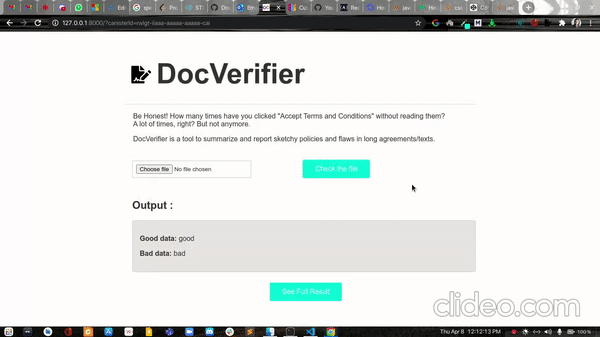

# DocVerifier

A tool to summarize and report any flaws in a long agreement/text. This tool will help us to protect ourselves from accepting malicious agreetments, privacy policies, terms and conditions etc. It uses Naive Bayes classification to make the predictions.
<p align="center">

</p>


### Deployed Url in DFINITY
- https://rwlgt-iiaaa-aaaaa-aaaaa-cai.ic0.app/

### Deployed API url
- https://check-privacy.herokuapp.com/

## How does it work

### For Chrome Extension

1. The user clicks on the button in the chrome extension, we get the current tab Url.
2. This Url is then passed to the backend via the flask API.
3. We then scrape the URL using Beautiful soup in python, to get all the Privacy policies, Terms of services links present in the website.
4. The Urls that we get after the first scraping is used to get the privacy policies text using another scraper that uses NLP to get the best result.
5. These texts are stored in a file which is then provided to the ML model that uses Naive bayes classification method, to predict the bad sentences presen if any in the privacy texts.
6. We then display all the malicious sentences in the chrome extension itself.

### For DFINTY App

- The user will upload any text document that will go the backend filesystem and will be provided to the ML model to make the predictions.
- We then display all the malicious sentences in the web app.

## Future Scopes

- Making the ML model more efficient by getting more training datasets.
- Also predict the flaws in the website cookies.
- Integrating file upload in the chrome extension itself.

## Prerequisites

1.  [Git](https://git-scm.com/downloads).
2.  [Node & npm](https://nodejs.org/en/download/) _(version 12 or greater)_.
3.  A fork of the repo.
4.  Python3 environment to install flask
5.  DFINITY Canister SDK package(need access to a terminal shell for MacOS or Linux.)

## How to run the project locally

- Clone this repo to your local machine using `https://github.com/Open-Sourced-Olaf/DocVerifier`
- Move to the cloned repository `cd DocVerifier`

### Steps to run backend( Flask API)

In order to install all packages follow the steps below:

1.  Move to flask-api folder `cd flask-api`
2.  For installing virtual environment - `python3 -m pip install --user virtualenv`
3.  Create A Virtual env - `python3 -m venv env`
4.  Activate virtual env - `source env/bin/activate`
5.  `pip3 install -r requirements.txt`
6.  `flask run`

> The model will be served on **http://127.0.0.1:5000/**

### Steps To Set Up custom_greeting(Dfinty App)

1.  Move to custom_greeting folder
2.  Install all the npm packages `npm install`
3.  Start the Internet Computer network on your local computer by running the following command:`dfx start --background`
4.  To deploy the App, run `dfx deploy`
5.  To get the canister Id of assets, run `dfx canister id custom_greeting_assets`
6.  The deployed Url will look like this `http://127.0.0.1:8000/?canisterId=ryjl3-tyaaa-aaaaa-aaaba-cai`
7.  Whenever we make any changes in the code, want to rebuild the website.

- Run `dfx build` to rebuild the project
- Then run `dfx canister install --all --mode reinstall` to deploy the project changes

### Deploying to internet computer

- Stop the internet computer using `dfx stop`
- Check if our current internet connection will allow us to connect to the Internet Computer network: `dfx ping ic`
- Build and deploy the sample application to the Internet Computer by running the command `dfx deploy --network=ic`

### Loading the Chrome extension

- Go to the `chrome://extensions` in the browser
- Click on _load unpacked_ and choose the `get-current-tab-url` folder.
- Publish it in chrome web store
  - To publish your item to the Chrome Web Store, follow these steps:
  1. Create your item's zip file
  2. Create a developer account *https://chrome.google.com/webstore/devconsole/*
  3. Upload your item
  4. Add assets for your listing
  5. Submit your item for publishing

## Directory Structure

The following is a high-level overview of relevant files and folders.

```
DocVerifier/
├── flask-api/
│   ├── static/uploads
│   └── app.py

└── custom_greeting/
    ├── node_modules/
    ├── src/
    │   ├── custom_greeting/
    │   │   ├── main.mo
    │   ├── custom_greeting_assets/
    │   │   ├── assets
    │   │   └── public
         ├── dfx.json
         ├── package.json
         |__ webpack.config.js
         |__tsconfig.json
         |__ .gitignore
 |
 |__get-current-tab-url
       |_ background.js
       |_ icon.png
       |_ manifest.json
       |_ window.html
       |_ style.css

```

## Challenges we ran into

- Collected the good and bad policies for training our model was a time consuming task.
- Not finding any way to have file upload popup working in a chrome extension.

## How to contribute.

- Fork and clone the repository `git clone https://github.com/Open-Sourced-Olaf/DocVerifier`
- Create a branch `git checkout -b "branch_name"`
- Make changes in that branch
- Add and commit your changes`git add . && git commit -m "your commit message"`
- Then push the changes into your branch `git push origin branch_name`
- Now you can create a PR using that branch in our repository.
- :tada: you have successfully contributed to this project.

## Useful links and references

- https://mlh-fellowship.gitbook.io/fellow-handbook/sponsor-resources/dfinity
- https://sdk.dfinity.org/docs/developers-guide/tutorials/custom-custom_greeting.html

## Contributors ✨

Shoutout goes to these wonderful people:

<table>
  <tr>
    <td align="center"><a href="https://github.com/anjalisoni3655/">
        
        <br />
        <sub>
            <b>Anjali Soni</b>
        </sub>
        </a>
        <br />
        <a href="https://github.com/Open-Sourced-Olaf/DocVerifier/commits?author=anjalisoni3655" title="Code">💻</a>
      </td>
    <td align="center"><a href="https://github.com/steven-tey">
        
        <br />
        <sub><b>Steven Tey</b></sub>
        </a>
        <br />
        <a href="https://github.com/Open-Sourced-Olaf/DocVerifier/commits?author=steven-tey" title="Code">💻</a>
      </td>
     <td align="center"><a href="https://github.com/ShrillShrestha">
         
         <br /><sub><b>Shrill Shrestha</b></sub>
         </a>
         <br />
         <a href="https://github.com/Open-Sourced-Olaf/DocVerifier/commits?author=shrill-shreshtha" title="Code">💻</a>
      </td>
    <td align="center"><a href="https://github.com/rashi-sharma/">
        
        <br />
        <sub><b>Rashi Sharma</b></sub></a><br /><a href="https://github.com/Open-Sourced-Olaf/DocVerifier/commits?author=rashi-sharma" title="Code">💻</a>
      </td>
  </tr>
</table>
